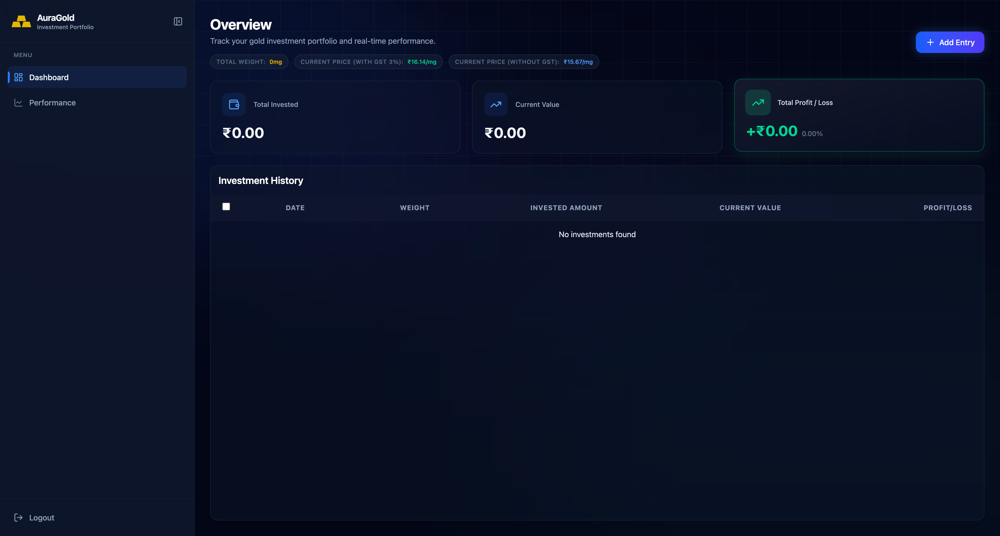

# 🌟 Gold Tracker - Smart Gold Investment Tracker

Gold Tracker is a premium, high-performance web application designed for investors to track their gold holdings with precision and elegance. It features real-time price tracking, portfolio analytics, and a stunning glassmorphic interface.



## ✨ Key Features

- **💎 Real-time Gold Tracking**: Live price updates for 24K gold with automatic GST (3%) calculation.
- **📊 Portfolio Overview**: Comprehensive dashboard showing total invested amount, current market value, and real-time Profit/Loss metrics.
- **📈 Performance Analytics**: Interactive historical performance charts visualizing portfolio growth over time using Recharts.
- **🔒 Secure Authentication**: Robust JWT-based authentication system with secure login, signup, and protected routes.
- **🚀 Performance Optimized**: Implements React Lazy loading, code splitting, and professional skeleton loaders for a lightning-fast user experience.
- **📱 Fully Responsive**: Seamless experience across mobile, tablet, and desktop with a custom responsive sidebar.
- **🎨 Premium UI/UX**: Modern dark-themed aesthetic featuring glassmorphism, smooth Framer Motion animations, and custom Tailwind styling.

## 🛠️ Tech Stack

### Frontend

- **Framework**: React 18 (Vite)
- **State Management**: Redux Toolkit & RTK Query
- **Animations**: Framer Motion
- **Charts**: Recharts
- **Styling**: Tailwind CSS
- **Icons**: Lucide React
- **Routing**: React Router DOM v6

### Backend

- **Runtime**: Node.js
- **Framework**: Express.js
- **Database**: MongoDB (Mongoose)
- **Security**: JWT (JSON Web Tokens) & Validator
- **Utilities**: Axios for live API integration

## 🚀 Getting Started

### Prerequisites

- Node.js (v18+)
- MongoDB Atlas account or local MongoDB instance
- npm or yarn

### Installation

1. **Clone the repository**

   ```bash
   git clone https://github.com/yourusername/gold-tracker.git
   cd gold-tracker
   ```

2. **Backend Setup**

   ```bash
   cd backend
   npm install
   ```

   Create a `.env` file in the `backend` directory:

   ```env
   PORT=3000
   MONGO_URI=your_mongodb_connection_string
   JWT_SECRET=your_super_secret_key
   FRONTEND_URL=http://localhost:5173
   NODE_ENV=local
   ```

   Start the backend:

   ```bash
   npm start
   ```

3. **Frontend Setup**
   ```bash
   cd ../frontend
   npm install
   ```
   Create a `.env` file in the `frontend` directory:
   ```env
   VITE_API_URL=http://localhost:3000/api
   ```
   Start the development server:
   ```bash
   npm run dev
   ```

## 📐 Project Structure

```text
├── frontend/
│   ├── src/
│   │   ├── components/      # Reusable UI & Layout components
│   │   ├── pages/           # Main page views (Dashboard, Performance, etc.)
│   │   ├── redux/           # Store and Slices
│   │   ├── services/        # API services (RTK Query)
│   │   └── utils/           # Helper functions
├── backend/
│   ├── src/
│   │   ├── controllers/     # Business logic
│   │   ├── model/           # Database schemas
│   │   ├── routes/          # API endpoints
│   │   └── utils/           # Backend helpers
```

## 🔗 Connect with Me

- [Portfolio](https://www.kaushikverma.com)
- [GitHub](https://github.com/itskaushikverma)
- [LinkedIn](https://www.linkedin.com/in/itskaushikverma)
- [Twitter](https://x.com/SilentK68296830)

## 📄 License

This project is licensed under the MIT License - see the [LICENSE](LICENSE) file for details.

---

Built with ❤️ for gold investors.
